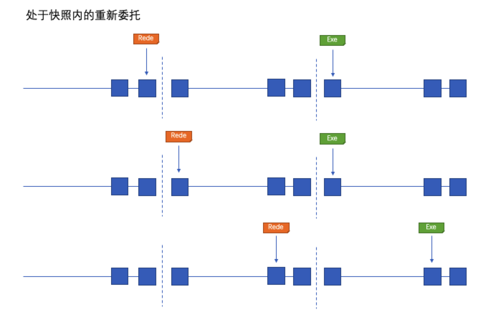
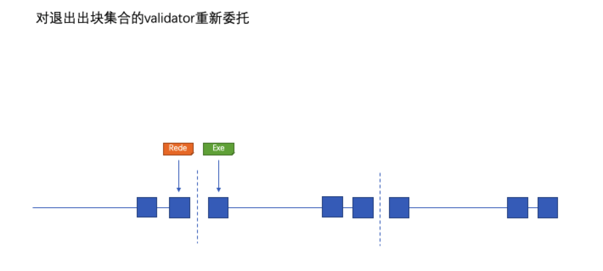
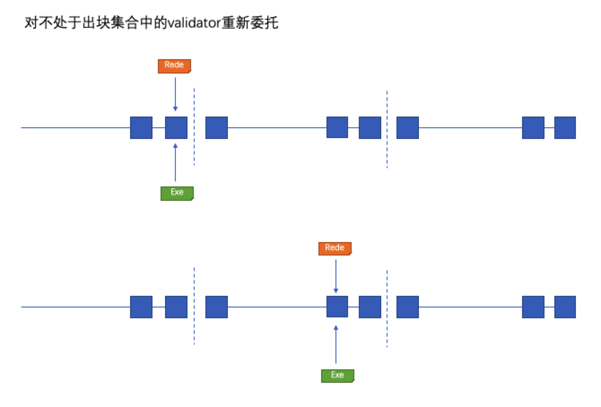

# staking

Staking is an important basic module supporting DEX’s PoS (Proof of Stake) consensus mechanism. It determines the number of block producer sets in each election period according to the total amount of delegated proof of stake accepted by super nodes, and dynamically determines the block order according to the voting power. Meanwhile, it also provides necessary support for delegation relationships and information query of super nodes to distribution and gov modules.

Through staking, you can freely create validators, update validators, delegate proof of stake to trusted validators, cancel delegation from validators that you no longer trust, and re-delegate proof of stake currently delegated to a validator to other validators.

## Rotation mechanism

OKChain will re-elect block generation nodes from each set at each fixed block height interval which is called cycle. The block generation set is fixed and the identities of block generation nodes in the set remain unchanged during the same cycle. At the penultimate block height interval during the same cycle, staking will rotate the block generation node sets for the next cycle. The top 21 nodes with the highest number of okt will become the block generation nodes in the next cycle, and the nodes which are not the top 21 ones with the highest number of okt in the set will be forced to quit. The number of okt should only be an integer, and the decimal part is not considered when the comparison of the numbers of nodes supported by the sets is made during rotation.

## cli command
staking cli contains the following 5 commands for PoS operations, providing complete support for equity circulation.


*  create-validator：create a validator

*  edit-validator：update a validator

*  delegate：delegate proof of stake

*  unbond：undelegate

*  redelegate：re-delegate

### Create a validator

Upgrade a node to a validator through self-delegation and set the description, commission rate and related change limits on a validator.

```bash
okchaincli tx staking create-validator --amount=2okt --pubkey=$(okchaind tendermint show-validator) --moniker="my nickname" --identity="logo|||http://mywebsite/pic/logo.jpg" --website="http://mywebsite" --details="my slogan" --commission-rate="0.10" --commission-max-rate="0.50" --commission-max-change-rate="0.01" --min-self-delegation="1" --from jack
```

* amount indicates the number of self-delegated okt
* pubkey represents the tendermint public key of the current node
* moniker indicates the alias of the validator
* identity specifies the address of the validator’s profile picture
* website indicates the validator’s website address
* details indicate the validator’s detailed description
* commission-rate indicates the current commission rate (rounded to at most 2 decimal places)
* commission-max-rate indicates the maximum commission rate of the validator that cannot be set to exceed the maximum commission rate (rounded to at most 2 decimal places)
* commission-max-change-rate indicates the maximum adjustment rate that is acceptable each time when the commission rate is adjusted. Adjustments exceeding such maximum adjustment rate become invalid (rounded to at most 2 decimal places)
* min-self-delegation indicates the minimum number of self-delegated okt. If the number is lower than the minimum number of self-delegated okt, the self-delegation is invalid
* from specifies the operator’s account, which is jack here

### Update a validator

The operator can update the description of the validator and adjust the commission rate.

```bash
okchaincli tx staking edit-validator --moniker=“my new nickname” --identity="logo|||http://mynewwebsite/pic/newlogo.jpg" --website="http://mynewwebsite" --details="my new slogan" --commission-rate="0.11" --from jack
```

- moniker indicates the alias of the validator to be updated
- identity specifies the address of the profile picture of the validator to be updated
- website indicates the website address of the validator to be updated
- details indicate the detailed description of the validator to be updated
- commission-rate indicates the commission rate to be updated which can only be updated once every 24 hours, and the adjustment cannot exceed commission-max-change-rate
- from specifies the operator’s account, which is jack here


### Delegate proof of stake

okchain users can delegate their proof of stake to several validators to authorize them to perform related obligations on their behalf, such as voting on proposals. By delegating proof of stake, users can receive rewards and participate in okchain governance.

```bash
okchaincli tx staking delegate okchainvaloper1005qzgwplwu8hf9pjhhtlm0t2x27hyppgqc2w6 20okt  --from rose
* In the example, okchainvaloper1005qzgwplwu8hf9pjhhtlm0t2x27hyppgqc2w6 is the validator’s address, and 20okt is the number of okt to be delegated.
```

* from indicates the delegate user’s account, which is rose here

### Undelegate

okchain users can cancel the delegation and redeem their delegated shares for okt. Users must wait for 2 election periods to receive the redeemed okt after undelegation.

```bash
okchaincli tx staking unbond okchainvaloper1005qzgwplwu8hf9pjhhtlm0t2x27hyppgqc2w6 10 --from rose
* In the example, okchainvaloper1005qzgwplwu8hf9pjhhtlm0t2x27hyppgqc2w6 is the validator’s address, and 10 is the number of the delegated share to be undelegated
```

* from indicates the user account to be undelegated, which is rose here

### Re-delegate

okchain users can re-delegate the delegated shares at validator<sub>a</sub> to validator<sub>b</sub> by re-delegating transactions. Re-delegated transactions during the current cycle will be effective in the next cycle.

```bash
okchaincli tx staking redelegate okchainvaloper1005qzgwplwu8hf9pjhhtlm0t2x27hyppgqc2w6 okchainvaloper1alq9na49n9yycysh889rl90g9nhe58lcs50wu5 10 --from rose
* * In the example, okchainvaloper1005qzgwplwu8hf9pjhhtlm0t2x27hyppgqc2w6 is the validator_a’s address, and okchainvaloper1alq9na49n9yycysh889rl90g9nhe58lcs50wu5 is the validator_b’s address, and 10 is the number of the delegated share to be re-delegated
```

* from indicates the user account to be re-delegated, which is rose here

To ensure PoS security, re-delegated transactions within each cycle will be divided into three types for processing:


*  If the src validator of re-delegated transactions is the node that generates blocks in the next cycle, the transaction will be delayed until the next cycle. The earliest execution time is the first block height in the next cycle and the latest execution time is the penultimate block height in the next cycle. The re-delegated transactions in the same src validator will replace the delayed transactions and only the latest re-delegated transactions will be executed;




*  If the src validator of re-delegated transactions is the node that exits the block generation node set, the transaction will be delayed until the first block height is executed in the next cycle;




*  If the src validator of re-delegated transactions is not within the block generation node set in the next cycle and is not the node that exits the block generation node set, the transaction will be executed immediately.


